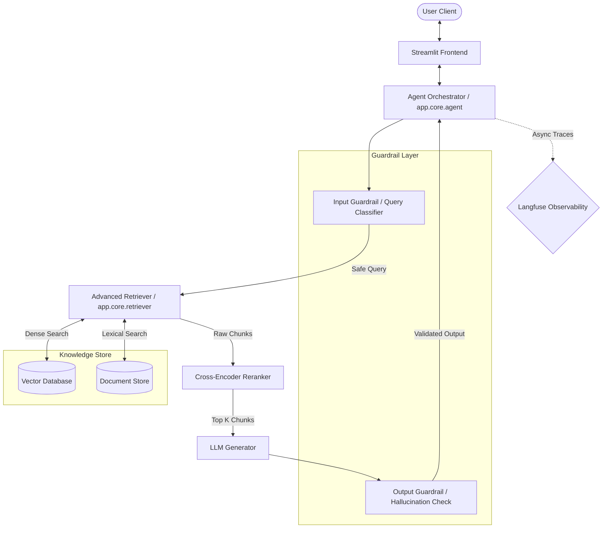
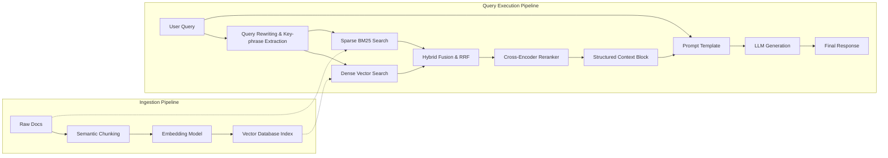
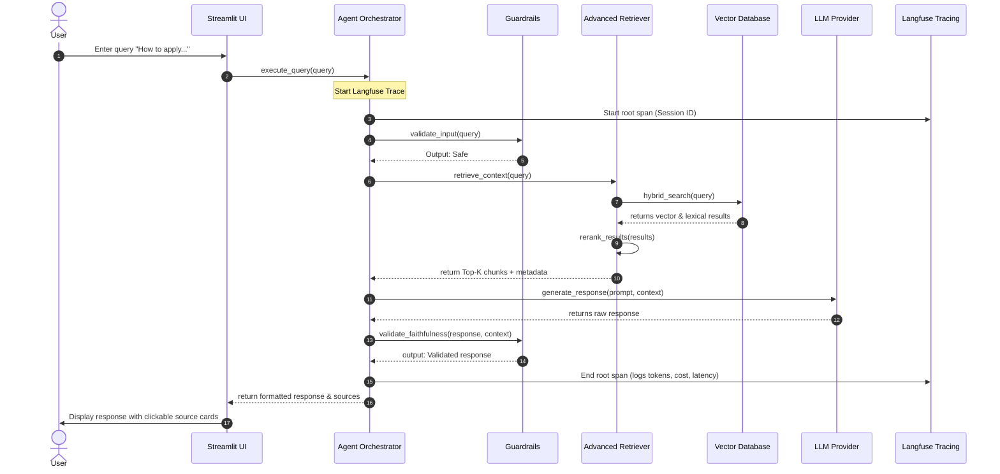
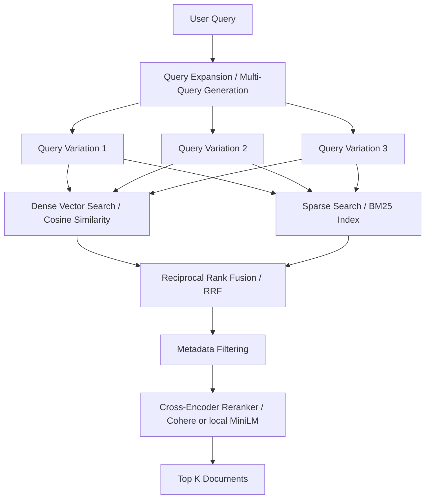
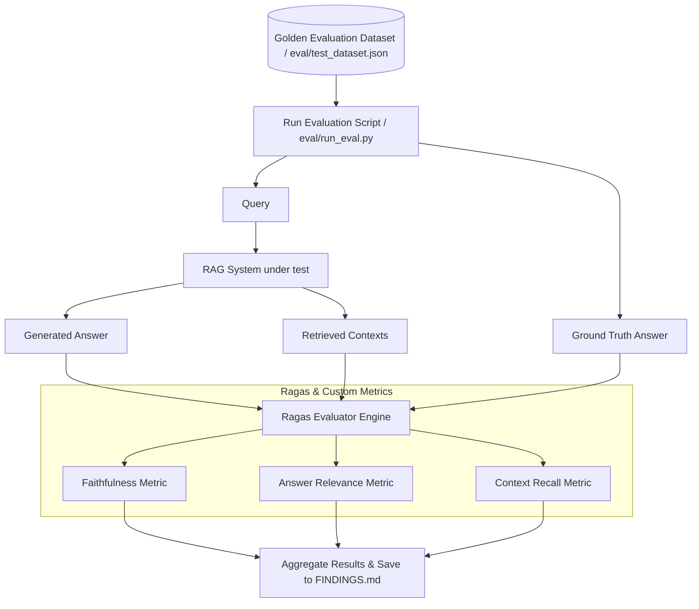
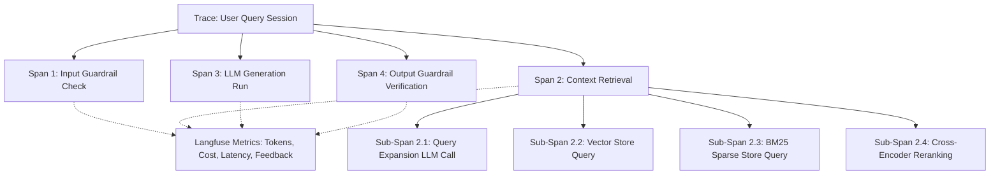

# Executive Architecture Memo: AI Copilot System
**To:** Project Stakeholders, Lead Instructors, and Evaluation Committee  
**From:** Senior Staff ML Engineer & AI Architect  
**Subject:** Week 16 Evaluability Core Architecture, System Flows, and Design Decisions  

---

## 1. Executive Summary
This memo outlines the end-to-end architecture, user experience, data flows, and evaluation methodologies for the Futurense AI Clinic Mini Project. The system is designed as an **Advanced Retrieval-Augmented Generation (RAG) Agent** equipped with query expansion, hybrid vector-lexical search, semantic re-ranking, runtime guardrails, automated metrics evaluation, and comprehensive tracing.

---

## 2. Core Flows & Journeys

### A. Business Goal
To build a highly reliable, low-latency, and context-aware AI assistant that reduces operational lookup times by >60% while maintaining a hallucination rate of <5% (faithfulness score >0.90) and providing clear, auditable sources for every response.

### B. User Flow (UX/UI)
1. **Initiation:** The user opens the web application and is presented with a clean, dark-mode dashboard featuring quick-action templates.
2. **Input:** The user types a query or selects a suggested query.
3. **Processing Visualizer:** The UI displays a micro-animation state showing step-by-step progress (e.g., "Analyzing query...", "Searching documentation...", "Synthesizing answer...").
4. **Output:** The user receives a structured markdown response containing:
   * Direct, synthesized answers.
   * **Source Citations** with expandable original chunks and metadata (document name, page number, confidence score).
   * Feedback controls (thumbs up/down) linked directly to the trace metrics.

### C. System Flow
1. **Ingestion (Offline):** Raw domain documents are processed, semantic chunks are generated, embedded, and index-persisted into a Vector Database.
2. **Routing & Guardrails (Online):** The incoming query is scanned for out-of-scope requests or prompt injection.
3. **Retrieval:** The query is routed to a hybrid search engine retrieving candidate documents from dense vector space and sparse lexical index.
4. **Re-ranking:** A cross-encoder model scoring module selects the top $K$ relevant passages.
5. **Synthesis:** The top passages and the query are structured into a prompt template and sent to the LLM.
6. **Output Guardrail:** The LLM's response is evaluated for faithfulness (no halluciated data) and formatted before returning to the UI.

### D. Data Flow
1. **Query Data:** Raw string user input.
2. **Augmented Prompt Data:** Injected context + System instructions + Conversational history.
3. **Trace Payload:** Logs, latencies, tokens, and span graphs pushed asynchronously to Langfuse.

### E. Evaluation Flow
1. **Test Suite Execution:** The `/eval` module runs queries from a predefined golden evaluation dataset.
2. **LLM-as-a-judge Evaluation:** Evaluator LLMs compare generated answers against the ground truth.
3. **Metric Compilation:** Results are calculated for:
   * **Faithfulness** (Is the answer derived *only* from retrieved context?)
   * **Answer Relevance** (Does the answer address the question?)
   * **Context Recall** (Did the retriever retrieve all facts needed?)

### F. Observability Flow
1. **Instrumented Callback Handlers:** Automatically trace every embedding lookup, db query, and LLM call.
2. **Performance Monitoring:** Langfuse UI aggregates latency, cost, prompt version control, and token count.

---

## 3. System Diagrams (Mermaid)

### A. High-Level Architecture

---

### B. Data Flow Diagram

---

### C. Sequence Diagram

---

### D. Retrieval Pipeline

---

### E. Evaluation Pipeline

---

### F. Langfuse Trace Flow

---

## 4. Design Decisions & Trade-offs

| Component | Design Choice | Alternatives | Trade-off / Rationale |
| :--- | :--- | :--- | :--- |
| **Retrieval Method** | **Hybrid Search (Dense + BM25) + Reranking** | Vector Search Only | Vector search captures semantic meaning but misses exact keyword matches (IDs, codes, policy terms). BM25 handles exact terms, Rerankers sort by absolute relevance. Cons: Slightly higher retrieval latency. |
| **Vector DB** | **ChromaDB (Local)** | PGVector / Pinecone | ChromaDB runs embedded, requires no network setup, and allows rapid local development. Pinecone has network overhead; PGVector requires running PostgreSQL. Chroma is chosen for portability in this clinic environment. |
| **LLM Orchestrator** | **Lightweight Custom SDK Wrapper** | LangChain / LlamaIndex | LangChain adds significant abstraction overhead and changes APIs frequently. A custom script using the OpenAI/Gemini SDK + Pydantic provides absolute control, faster debugging, and cleaner trace logs. |
| **Evaluation Framework**| **Ragas (LLM-as-a-judge)** | Manual Testing / BLEU/ROUGE | BLEU/ROUGE measures word overlap but fails to evaluate semantic accuracy. Manual testing is non-deterministic and unscalable. Ragas calculates exact semantic metrics. |
| **UI Framework** | **Streamlit** | Next.js / Custom HTML | Streamlit allows 100% Python-based web app development, saving frontend dev hours. Next.js offers superior design flexibility but increases compilation complexity. |
