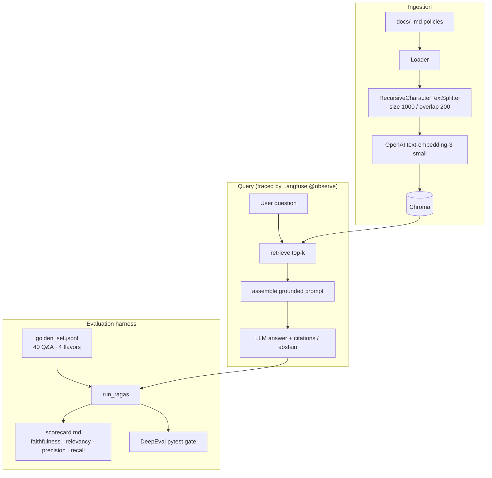

# AI Admission Copilot — Evaluable Core (Week 16)

A thin but **measurable** RAG slice for the AI Admission Copilot. It ingests
university admission-policy documents, retrieves the relevant context, and
answers with citations — and it ships with an evaluation + observability harness
so answer quality is a **number on a scorecard**, not a vibe.

This builds directly on the [Week 15 retrieval de-risk spike](https://github.com/Het0808/FuturenseAiClinic-W15):
the architecture I drew there is now a traced pipeline, and the KPI targets I set
there are the bar every metric is judged against.

> **Status / honesty note.** The code, corpus, and golden set are complete and
> real. The scorecard, Langfuse screenshots, experiment deltas, the LLM-diagnosis
> writeup, and the reflections are produced by **running the harness with your own
> API key** — they are intentionally *not* faked. Run `./run.sh` and the numbers
> are yours to defend in the viva. Sections awaiting that run are marked
> _(fill after run)_.

---

## Architecture



## Repository structure

```text
app/            RAG slice: ingest, retriever, generator, pipeline (@observe), cli
eval/           golden_set.jsonl, run_ragas.py (scorecard), targets, DeepEval gate
experiments/    run_experiments.py — change one knob, re-measure, report deltas
observability/  Langfuse setup + screenshots/
docs/           17 hand-authored admission-policy documents (the corpus)
llm_task/       DIAGNOSIS.md — the worst-case LLM diagnosis pass/fail gate
run.sh          one command to reproduce the scorecard
EXEC_MEMO.md    one-page interview-ready memo
```

## Setup

```bash
cd FuturenseAiClinic-W16
python3 -m venv venv && source venv/bin/activate
pip install -r requirements.txt
cp .env.example .env        # then add OPENAI_API_KEY
```

Embeddings use OpenAI `text-embedding-3-small` (per spec). Generation defaults to
`gpt-4o-mini`; set `GENERATION_PROVIDER=anthropic` in `.env` to use Claude instead.
Langfuse keys are optional — without them, tracing is a no-op and everything else
still runs.

## Run it (one command)

```bash
./run.sh                # build index + evaluate 40 golden questions -> eval/scorecard.md
# or step by step:
python -m app.ingest                       # build the Chroma index
python -m app.cli "How long can I defer?"  # ask one question (traced)
python -m eval.run_ragas                   # full scorecard
python -m experiments.run_experiments      # metric deltas
pytest eval/test_faithfulness_gate.py -v   # Tier A CI gate
```

## What "done" looks like — reproduce the scorecard

`python -m eval.run_ragas` runs the pipeline over the golden set and writes
[`eval/scorecard.md`](eval/scorecard.md): each metric, your score, the Week 15
target, and pass/fail. Per-question evidence lands in `eval/results_raw.jsonl`.

### The four core metrics (what each one asks)

| Metric | The question it answers | Ship target |
| :--- | :--- | :---: |
| **Faithfulness** | Does every claim trace back to retrieved context (no hallucination)? | ≥ 0.90 (≥ 0.70 floor) |
| **Answer relevancy** | Does the answer actually address the question? | ≥ 0.80 |
| **Context precision** | Are the retrieved chunks relevant, and well-ordered? | ≥ 0.70 |
| **Context recall** | Does the retrieved context contain the answer? | ≥ 0.80 |

#### Mathematical Formulations (Viva Reference)
* **Faithfulness (Groundedness):**
  $$\text{Faithfulness} = \frac{\text{Number of statements in answer supported by context}}{\text{Total number of statements in generated answer}}$$
* **Answer Relevancy:**
  $$\text{Answer Relevancy} = \frac{1}{N} \sum_{i=1}^{N} \text{CosineSimilarity}(q_i, q_{\text{original}})$$
  *(Where $q_i$ are $N$ hypothetical questions generated by the judge LLM based strictly on the output answer).*
* **Context Precision:**
  $$\text{Context Precision} = \frac{\sum_{k=1}^{K} P@k \cdot \text{rel}(k)}{\text{Total number of relevant retrieved items}}$$
  *(Where $P@k$ is precision at rank $k$, and $\text{rel}(k) \in \{0, 1\}$ is the relevance of chunk $k$).*
* **Context Recall:**
  $$\text{Context Recall} = \frac{\text{Number of facts in ground truth found in retrieved context}}{\text{Total number of facts in ground truth}}$$

Plus operational KPIs carried from the Week 15 PRD: **retrieval hit-rate @ k=3**
(≥ 0.95), **abstention accuracy** on out-of-corpus questions (≥ 0.90), **citation
accuracy** (≥ 0.90), **avg latency** (< 1.5s), **avg cost/query** (< $0.005).
Every target's provenance is recorded in [`eval/targets.py`](eval/targets.py).


### Baseline scorecard _(fill after run)_

> Paste the table from `eval/scorecard.md` here after running. Placeholder:

| Metric | Score | Target (Week 15) | Pass/Fail |
| :--- | :---: | :---: | :---: |
| faithfulness | _ | ≥ 0.90 | _ |
| answer_relevancy | _ | ≥ 0.80 | _ |
| context_precision | _ | ≥ 0.70 | _ |
| context_recall | _ | ≥ 0.80 | _ |
| retrieval_hit_rate | _ | ≥ 0.95 | _ |
| abstention_accuracy | _ | ≥ 0.90 | _ |
| citation_accuracy | _ | ≥ 0.90 | _ |
| avg_latency_s | _ | < 1.5s | _ |
| avg_cost_usd | _ | < $0.005 | _ |

## Golden eval set

40 hand-authored, corpus-verified Q&A pairs in
[`eval/golden_set.jsonl`](eval/golden_set.jsonl), across the four required flavors:

- **easy** (12) — single-document fact lookup.
- **ambiguous** (8) — vocabulary overlap that tempts the wrong document (the exact
  failure mode the Week 15 spike found, e.g. "fee waiver" vs. "financial aid",
  "defer enrollment" vs. "defer payment").
- **multi-hop** (11) — needs two documents (e.g. homeschooled *and* international
  testing requirements).
- **adversarial** (10) — answer is **not** in the corpus; the system must abstain
  with the fixed sentinel "I don't know based on the provided admission policies."

The committed set is hand-authored. [`eval/generate_golden.py`](eval/generate_golden.py)
shows the Ragas synthetic path for expanding it — outputs are marked `UNVERIFIED`
and must be hand-checked before merging (raw synthetic data fails).

## Experiments _(fill after run)_

[`experiments/run_experiments.py`](experiments/run_experiments.py) changes one
variable at a time and re-measures on the same golden set:

1. **top-k**: 3 → 5
2. **chunk size**: 1000/200 → 500/100 (rebuilds the index)

Results and the keep/revert decision land in
[`experiments/RESULTS.md`](experiments/RESULTS.md).

## Observability (Langfuse)

The pipeline is wrapped with `@observe()`; each run logs a trace with retrieval +
generation spans, tokens, latency, and cost. Setup and screenshot instructions:
[`observability/README.md`](observability/README.md).

- Trace screenshot — `observability/screenshots/trace.png` _(add after run)_
- Dashboard screenshot — `observability/screenshots/dashboard.png` _(add after run)_

## Tier coverage

- **Tier C (core):** working slice · 40-row golden set · Ragas baseline on the four
  metrics · live Langfuse tracing · experiments with measured deltas. ✅ (code complete)
- **Tier B (stretch):** adversarial/abstention handling + **abstention accuracy**
  metric · **citation accuracy** check · error-analysis of worst cases (see
  `llm_task/DIAGNOSIS.md` + the worst rows in `results_raw.jsonl`). ✅ (code complete)
- **Tier A (advanced):** DeepEval pytest gate on a faithfulness floor
  ([`eval/test_faithfulness_gate.py`](eval/test_faithfulness_gate.py)) · latency &
  cost-per-query in the scorecard · before-production note in `EXEC_MEMO.md`. ✅ (code complete)

## LLM-integrated task (pass/fail gate)

Take the worst-scoring question, have an LLM diagnose it, **try the fix, and
re-measure**. Template + gate rules: [`llm_task/DIAGNOSIS.md`](llm_task/DIAGNOSIS.md).
_(fill after run)_

## Reflection _(answer after run, 3–5 sentences each)_

1. **Where did the system fail most — retrieval or generation? How do the metrics
   tell you which?** _Hint: low `context_recall`/`context_precision` ⇒ retrieval;
   high recall but low `faithfulness` ⇒ generation._
2. **Did any metric look good while the answer was actually bad? What does that
   teach you about single-metric thinking?**
3. **Which Week 15 target did you hit, miss, or revise after seeing real numbers?**
   _(Week 15 projected 80% hit-rate from a mock run and a ≥95% target.)_

## KPI cheat-sheet (for the viva)

- **Hit-rate @ k=3** = fraction of answerable questions where an expected source
  appears in the top-3 retrieved chunks. Pure retrieval signal.
- **Faithfulness** (Ragas) = of the claims in the answer, the fraction supported by
  retrieved context. Low ⇒ hallucination.
- **Answer relevancy** (Ragas) = how well the answer addresses the question
  (LLM generates candidate questions from the answer, compares to the original).
- **Context precision** (Ragas) = are the retrieved chunks relevant and ranked well.
- **Context recall** (Ragas) = does the retrieved context contain everything the
  reference answer needs. Low ⇒ retrieval missed something.
- **Abstention accuracy** = of the 10 out-of-corpus questions, the fraction the
  system correctly refused to answer.
- **Citation accuracy** = of cited filenames, the fraction that were actually in
  the retrieved context (not invented).

---

## RAG Operations Mitigation Matrix (Troubleshooting Guide)

| Failure Scenario | Symptom | Diagnostic Metric | Targeted Engineering Remedy |
| :--- | :--- | :--- | :--- |
| **Hallucination** | LLM creates facts not present in text | Low **Faithfulness** | Force `temperature=0.0`, wrap contexts in XML boundaries, inject strict fallback instructions. |
| **Out-of-Scope Answer** | System responds to prompt injections / off-topic queries | Low **Abstention Accuracy** | Place an **Input Guardrail** classifier layer before retrieval to fail fast on unsafe inputs. |
| **Factual Incompleteness** | Answer misses key multi-hop parameters | Low **Context Recall** | Enable **Hybrid Retrieval (Dense + BM25)**, expand K search bounds, use parent-child chunks. |
| **LLM Disorientation** | System is distracted by noise in context | Low **Context Precision** | Deploy a **Cross-Encoder Reranker** to filter and sort the top chunks before synthesis. |
| **System Bottleneck** | End-to-end response exceeds latency targets | High **Avg Latency** | Switch to lighter models (`gpt-4o-mini`), implement prompt caching, optimize vector index. |
