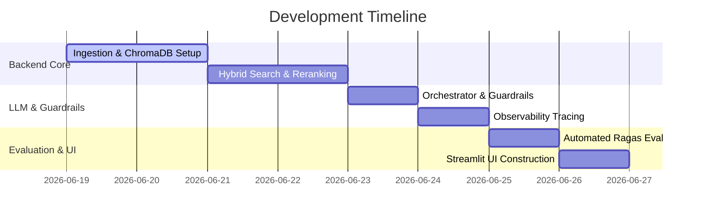

# System Architecture & Development Roadmap
This document details the software components, design justifications, technology alternatives, development milestones, and project timeline.

---

## 1. Architectural Decisions & Alternatives

### A. Document Chunking Strategy
* **Design Choice:** **Hierarchical Parent-Child Chunking**.
* **Reasoning:** Large chunks are needed for LLM synthesis to preserve context, but small chunks are better for vector indexing to match queries accurately. Parent-child relationships (e.g., retrieving 200-token child chunks but injecting the 1000-token parent chunk into the LLM context) solve this conflict.
* **Alternatives:**
  1. *Fixed-size overlapping chunking:* Simpler to implement but results in fractured concepts or context loss.
  2. *Semantic (Sentence-boundary) chunking:* Good for simple documents but can lead to variable chunk sizes that break token limits on complex documents.

### B. Index & Database Layer
* **Design Choice:** **ChromaDB (Local Persistence)**.
* **Reasoning:** Allows fully local, zero-network-dependency vector database setup inside the workspace. Persists data as files so indexing doesn't need to run on every startup.
* **Alternatives:**
  1. *FAISS:* Fast and lightweight, but lacks native metadata filtering features.
  2. *Qdrant / Pinecone:* Production-grade, but introduces network setup overhead, API keys, or Docker dependencies.

### C. Search & Retrieval Pipeline
* **Design Choice:** **Hybrid Retrieval (Dense Embeddings + BM25 Sparse Search) with Cross-Encoder Reranking**.
* **Reasoning:** Dense vectors capture user intent, while BM25 handles course codes, abbreviations, and clinical codes. The Cross-Encoder model acts as a precision filter to sort retrieved candidate documents before sending them to the LLM.
* **Alternatives:**
  1. *Vector Search Only:* High risk of missing exact keyword matches or reference identifiers.
  2. *Keyword Search Only:* Inability to answer conversational, paraphrased queries.

---

## 2. Development Roadmap & Milestones

### Milestone 1: Ingestion & Vector Setup (Days 1–2)
* **Goal:** Set up document loaders, chunking strategies, and establish the ChromaDB local storage pipeline.
* **Deliverables:** `app/core/config.py`, `experiments/chunking_analysis.ipynb`.

### Milestone 2: Hybrid Retrieval & Reranker Spike (Days 2–3)
* **Goal:** Implement the sparse index, vector query system, Reciprocal Rank Fusion, and cross-encoder scoring.
* **Deliverables:** `app/core/retriever.py`, `experiments/retrieval_spike.py`.

### Milestone 3: LLM Synthesis, Prompts & Guardrails (Days 3–4)
* **Goal:** Configure system prompts with citations, wrap in the LLM execution service, and build classification guardrails.
* **Deliverables:** `app/core/prompts.py`, `app/core/agent.py`.

### Milestone 4: Telemetry & Observability (Day 4)
* **Goal:** Integrate Langfuse callback tracing for logging inputs, latency, and costs.
* **Deliverables:** `observability/langfuse_client.py`.

### Milestone 5: Automated Evaluation Suite (Day 5)
* **Goal:** Create the golden Q&A dataset and run Ragas evaluations to confirm target metrics.
* **Deliverables:** `eval/test_dataset.json`, `eval/run_eval.py`.

### Milestone 6: UI & Delivery (Day 6)
* **Goal:** Connect all logic to the Streamlit UI with micro-animations, clickable footnotes, and source summaries.
* **Deliverables:** `app/ui/main.py`, `app/ui/components.py`.

---

## 3. Project Timeline (Daily Plan)

* **Day 1 (Ingestion):** Implement document parsers and chunking configurations.
* **Day 2 (Indexing):** Initialize ChromaDB, write documents to disk, test vector recovery.
* **Day 3 (Retrieval):** Build BM25 index on text chunks, write RRF merge function, integrate cross-encoder.
* **Day 4 (Core LLM & Telemetry):** Draft agent prompt templates, add input/output guardrails, configure Langfuse.
* **Day 5 (Evaluation):** Construct 20+ reference question-answer pairs, run validation script, output results.
* **Day 6 (Frontend):** Build Streamlit dashboard, hook backend retrieval/generation triggers, test user feedback capture.
